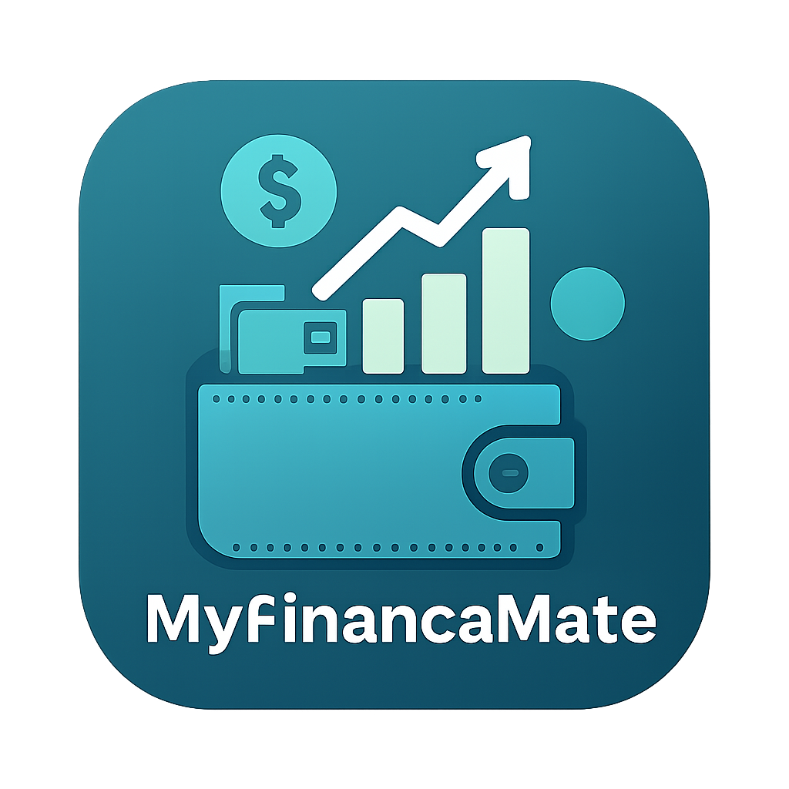

# MyFinanceMate



MyFinanceMate is a **privacy‑first, open‑source expense tracking** Android app built with Jetpack Compose. It parses SMS bank alerts, stores data locally with Room, and visualises spending via bar‑ and pie‑charts.

---

## Features

- **Secure app lock** – PIN or biometric authentication on launch and after background.
- **Automatic SMS parsing** for incoming transaction notifications.
- **Beautiful reports** – interactive bar chart for the last 7 days and expense distribution pie chart.
- **Dark / Light themes** with custom gradient splash screen.
- **Fully offline** – no network required; all data stored locally.
- **Reminders** – set up payment reminders with recurrence.
- **Backup & Restore** – export and import your data.

---

## Installation

### From F-Droid
Search for "MyFinanceMate" on [f-droid.org](https://f-droid.org) or add the repository:
```
https://f-droid.org/packages/com.myfinancemate/
```

### Build from Source
1. Clone the repository:
   ```bash
   git clone https://github.com/Dave-1/MyFinanceMate.git
   cd MyFinanceMate
   ```
2. Open the project in Android Studio (Hedgehog or newer) and let Gradle sync.
3. Run the app on an emulator or device.

---

## Building a Release APK

```bash
./gradlew assembleRelease
```
The signed APK will be located at `app/build/outputs/apk/release/app-release.apk`.

---

## License

This project is licensed under the **MIT License** – see the [LICENSE](LICENSE) file for details.

---

## Contributing

Feel free to open issues or submit pull requests. Please keep contributions under a permissive open‑source license.
